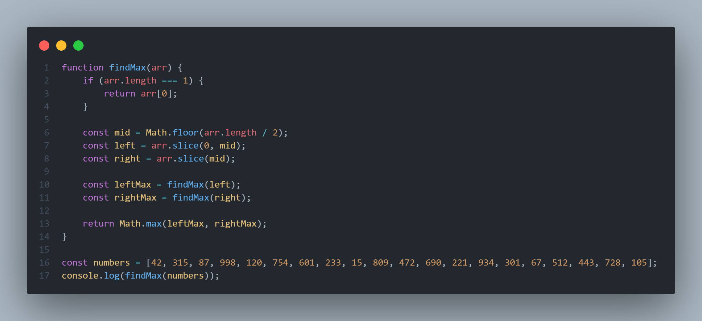

# ¡Welcome back to my JavaScript Repository Mod04!

Este repositorio ha sido iniciado en abril de 2025 como un espacio para compartir evidencias del trabajo de clase correspondiente a la Cuarta Unidad del Curso de FrontEnd impartido por DEV.F. En esta extensión estaremos reforzando nuestro conocimiento sobre JavaScript, un lenguaje de programación que complementa a HTML y CSS para darle vida a nuestro sitio web.

## Funcionamiento del sitio
Dentro de este repositorio podrá encontrar, en cada una de las carpetas, las prácticas realizadas como proyectos durante cada lección. Además de los apuntes de la clase, regularmente dentro de la carpeta "Clase00" encontrará otra carpeta con la práctica correspondiente.
Al explorar cada uno de los archivos se percatará que todo está claramente comentado para su entendimiento.

## Contenido
A continuación, se compilará una reseña del trabajo llevado a cabo en cada una de las clases del curso. Esta sección se actualizará periódicamente hasta la culminación del módulo 04.

### Clase 01: Introducción a ECMAScript
ECMAScript es el estándar que define cómo funciona JavaScript, incorporando mejoras en sintaxis, estructuras y funcionalidad. Hemos trabajado con ECMAScript 6, utilizando clases, funciones flecha, let y const para escribir un código más limpio y moderno. Aplicamos for...of para recorrer arreglos de manera más elegante y exportamos funciones entre archivos usando módulos. Esto nos permitió estructurar mejor nuestra lógica y preparar una pequeña aplicación de viajes. Con estas bases, nuestro código es más organizado, eficiente y fácil de mantener.

### Clase 02: Estructuras de datos
En esta práctica vimos varias estructuras de datos en JavaScript. El arreglo (Array) sirve para almacenar elementos ordenadamente y permite duplicados. El Set (conjunto) almacena valores únicos sin repeticiones, ideal para evitar duplicados automáticamente. Usamos Set porque su método .has() nos permite verificar si un producto ya existe, .add() agrega elementos, .delete() elimina y .size nos dice cuántos elementos hay. También usamos for...of para recorrer estructuras como Set de forma sencilla. Gracias a estas estructuras, hicimos una lista de compras limpia, ordenada y sin errores de duplicados.

### Clase 03: Métodos de arreglos
Hoy nos enfocamos en practicar los métodos filter(), sort() y map() aplicados a arreglos en JavaScript. Utilizamos sort() para ordenar productos alfabéticamente según su nombre, asegurando un orden correcto de los elementos. Con filter(), aprendimos a extraer productos que pertenecen a una categoría específica, como "Electrónica" o "Ropa". Además, empleamos map() para crear nuevos arreglos que contenían solo los nombres o precios de los productos. Estos métodos nos facilitaron transformar, organizar y seleccionar datos de manera rápida y estructurada.

### Clase 04: Algoritmo de los Dos Punteros
El algoritmo de los dos punteros es una técnica eficiente para recorrer arreglos ordenados utilizando dos índices que avanzan según ciertas condiciones. Se emplea comúnmente para buscar pares de elementos que cumplan una propiedad específica, como sumar un valor objetivo o compartir una característica. Funciona comparando los valores en las posiciones de los punteros y ajustándolos hacia el centro o de forma secuencial. En este proyecto, el arreglo de nombres está ordenado alfabéticamente, lo que permite usar esta técnica para encontrar el primer par de nombres que comienzan con la misma letra. Los punteros inicio y siguiente recorren el arreglo sin repetir comparaciones.

### Clase 05: Sliding Window
El patrón Sliding Window es una técnica algorítmica eficiente para resolver problemas relacionados con secuencias, como arreglos o cadenas, permitiendo procesar segmentos del conjunto sin reiniciar el análisis completo en cada paso. En esta práctica, aplicamos una versión simple del patrón para analizar un texto palabra por palabra. El objetivo fue encontrar la palabra más larga recorriendo el arreglo generado.

### Clase 06: Recursión y Backtracking
La recursión es una técnica en programación donde una función se llama a sí misma para resolver un problema dividiéndolo en subproblemas más pequeños. El backtracking es una estrategia basada en recursión que explora todas las posibles soluciones y retrocede cuando una opción no lleva al resultado deseado. Ambos métodos son útiles para resolver problemas como búsqueda, combinaciones o laberintos. En la práctica realizada, usamos recursión para buscar un regalo dentro de una lista, evaluando cada elemento hasta encontrar el deseado o llegar al final. Esta actividad refuerza la lógica de casos base y llamadas recursivas paso a paso.

### Clase 07: Divide and Conquer
Divide and Conquer (Dividir y Vencer) es una técnica algorítmica que resuelve problemas al dividirlos en subproblemas más pequeños, resolver cada uno recursivamente y combinar sus soluciones. Este enfoque es eficiente para arreglos grandes, ya que reduce el problema paso a paso. En la práctica realizada, se aplicó esta técnica para encontrar el número máximo en un arreglo dividiéndolo en mitades hasta llegar a arreglos de un solo elemento. Luego se compararon los máximos de cada parte usando Math.max. Esto refuerza cómo combinar recursión con lógica para resolver problemas más complejos.

